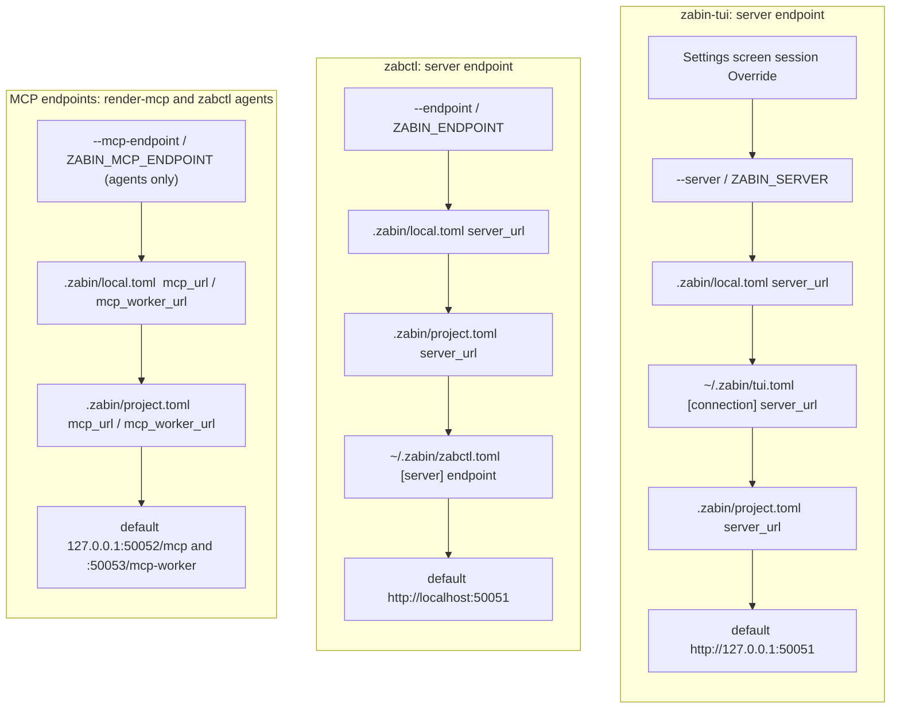

# Zabin configuration files

Zabin ships three binaries, and each one is configured from a small set of files plus flags and
`ZABIN_*` environment variables. This page maps every file, says which binary reads it, and shows
how a per-project `.zabin/local.toml` overrides the machine-wide defaults for `zabin-tui`, `zabctl`,
and the MCP adapters your coding agent uses.

The short version:

- **`~/.zabin/`** is *your* machine-wide configuration: one file per client (`tui.toml`, `zabctl.toml`),
  the agent-installer record (`agents.toml`), token files, and the daemon's database.
- **`<checkout>/.zabin/`** is *the project's* marker: a committed `project.toml` that tells every
  client which project this checkout is and where its server lives, plus an optional, gitignored
  `local.toml` that overrides it on this machine only.
- **`zabin-server` has no config file.** It is configured entirely by flags and environment
  variables, or by the `[daemon]` profile in `tui.toml` when `zabin-tui` launches it for you.
- A **flag or environment variable always wins**, then `local.toml`, then the machine-wide file or the
  committed marker (the two clients order those two layers differently, see below), then a default.

This is an overview. The full reference, with every rule and edge case, is the managed
documentation inside a running Zabin (`zabctl docs get docs/CONFIGURATION.md --project <id>`, or the
TUI's project-level Docs tab): `docs/CONFIGURATION.md` is the index, and `docs/CLIENT-CONFIGURATION.md`,
`docs/SERVER-CONFIGURATION.md`, `docs/DAEMON-CONTROL.md`, and `docs/PM-SURFACE.md` are the
satellites.

## Every file, in one tree

```text
~/.zabin/                          machine-wide, owned by the operator (created 0700)
├── tui.toml                       zabin-tui  [connection] [auth] [ui] [daemon]
├── zabctl.toml                    zabctl     [server] endpoint / tls / ca_cert, api_key, token_file   (0600)
├── agents.toml                    zabctl agents: repo, clone dir, install root, clients recorded    (0600)
├── installer-manifest.json        zabctl agents install: ownership manifest of the rendered adapters
├── zabin-agents/                  clone of the agent-contracts bundle (zabin-app/zabin-agents)
├── mcp.token                      bearer token files the daemon is pointed at (by convention;
├── mcp-worker.token                 any path works, each must be 0600, no two may share a secret)
├── mcp-pm.token
├── <project>-grpc.token           a per-user gRPC token, named by [auth] token_file / token_file
├── zabin.db                       the daemon's SQLite database (default --db-path)
├── models/                        embedding model cache (default: <db-path parent>/models)
└── server/traces.db               daemon traces

<checkout>/                        one per project
├── .zabin/project.toml            COMMITTED marker: project_id + server_url + mcp_url + mcp_worker_url
├── .zabin/local.toml              GITIGNORED overlay: same keys, key by key, plus token_file
├── .mcp.json                      rendered by `zabctl project render-mcp` from the two files above
└── .envrc / .zabinenv             optional direnv recipe that exports ZABIN_MCP_TOKEN & co.
```

`~/.claude/`, `~/.codex/`, `~/.agents/` and friends receive rendered adapters from
`zabctl agents install`, but those are outputs, not configuration: rerun the install to change them.

## Who reads what

| File | `zabin-tui` | `zabctl` | `zabctl agents` / `render-mcp` | `zabin-server` | Coding-agent MCP client |
|---|---|---|---|---|---|
| `~/.zabin/tui.toml` | yes, all four sections | no | no | indirectly: `[daemon]` becomes its argv | no |
| `~/.zabin/zabctl.toml` | no | yes | no (dispatched before it is read) | no | no |
| `~/.zabin/agents.toml` | no | no | yes: remembered repo, clone dir, clients | no | no |
| `.zabin/project.toml` | `project_id`, `server_url`, `token_file` (reported, never opened) | `server_url`, `token_file` (reported, never opened) | `mcp_url`, `mcp_worker_url` (loopback only) | no | no |
| `.zabin/local.toml` | `project_id`, `server_url`, `token_file` | `server_url`, `token_file` | `mcp_url`, `mcp_worker_url` | no | no |
| `.mcp.json` | no | no | written by `render-mcp` | no | yes: server URLs + `${ZABIN_MCP_TOKEN}` refs |
| token files | via `[auth] token_file` / marker `token_file` | via `token_file` | `doctor --mode live` only | `--mcp-*-token-file`, `--master-key-file` | via the exported variable |
| `ZABIN_*` variables | `ZABIN_SERVER`, `ZABIN_API_KEY`, `ZABIN_TLS`, `ZABIN_CA_CERT`, `ZABIN_ACTOR`, `ZABIN_DAEMON_*` | `ZABIN_ENDPOINT`, `ZABIN_API_KEY`, `ZABIN_TOKEN_FILE`, `ZABIN_TLS`, `ZABIN_OUTPUT` | `ZABIN_MCP_ENDPOINT`, `ZABIN_MCP_WORKER_ENDPOINT` | every flag has a `ZABIN_*` twin | `ZABIN_MCP_URL`, `ZABIN_MCP_TOKEN`, `ZABIN_MCP_WORKER_URL`, `ZABIN_MCP_WORKER_TOKEN` |

## How the layers stack

Every client resolves its server endpoint by walking a chain from most specific to least specific
and stopping at the first layer that sets the key. The chains are almost the same for both clients,
with one deliberate difference: **`zabin-tui` lets your machine-wide file beat the committed marker,
`zabctl` does not.**



The same picture as plain text, highest layer first:

```text
zabin-tui endpoint    Override > --server/ZABIN_SERVER > local.toml > tui.toml [connection] > project.toml > default
zabctl endpoint       --endpoint/ZABIN_ENDPOINT > local.toml > project.toml > zabctl.toml [server] > default
MCP adapter endpoints --mcp-endpoint/ZABIN_MCP_ENDPOINT > local.toml > project.toml > default
project id            --project > local.toml > project.toml > Project Picker
```

Why the asymmetry: the TUI is the operator's own surface, so a remote daemon named once in
`tui.toml` should apply to every checkout on the machine without a `local.toml` in each clone.
`zabctl` is a scripting tool that is expected to follow the checkout it is run in. In practice
this means that when a committed `project.toml` names a different server than your machine-wide
files, `zabin-tui` and `zabctl` can dial different daemons from the same directory. The TUI
Settings screen shows an `overrides` row naming the marker endpoint it discarded, and
`zabctl config view` prints the effective endpoint and its source.

### `.zabin/local.toml` overlays `.zabin/project.toml` key by key

The two marker files share one four-key schema. `local.toml` does not replace `project.toml`; it
overlays it one key at a time, so a `local.toml` that sets only `server_url` still inherits the
committed `project_id` and MCP URLs.

```toml
# .zabin/project.toml  (committed, written by `zabctl project init` or the MCP register_project tool)
project_id     = "prj_0000019fcd67a84fakwziyFM"
server_url     = "http://127.0.0.1:50051"
mcp_url        = "http://127.0.0.1:50052/mcp"
mcp_worker_url = "http://127.0.0.1:50053/mcp-worker"
```

```toml
# .zabin/local.toml  (gitignored, hand-written, strictly parsed: a typo is an error, not a silent skip)
server_url = "http://100.64.0.7:50061"
token_file = "~/.zabin/myproject-grpc.token"
```

With both files present, the TUI and `zabctl` dial `100.64.0.7:50061` with the token from
`~/.zabin/myproject-grpc.token`, while `.mcp.json` and the agent adapters keep the committed loopback
MCP URLs. Both files are found by walking up from the working directory (up to 64 levels, stopping at
a repository boundary), so a nested `pkg/.zabin/` wins over the repository root's. A marker at `$HOME`
is only used when you run from `$HOME` itself, never inherited by a scratch directory under it.

### Credentials follow a stricter rule than endpoints

Where an endpoint comes from decides whether a bearer token is sent to it:

| Endpoint came from | Endpoint honoured? | Credential attached? |
|---|---|---|
| flag or environment variable | yes | yes |
| `.zabin/local.toml`, verified untracked by git (and not a symlink) | yes | yes |
| `.zabin/local.toml` that is tracked, or whose status cannot be verified | yes | **no**, with a warning |
| `~/.zabin/tui.toml` or `~/.zabin/zabctl.toml` | yes | yes |
| `.zabin/project.toml` (committed) | yes | **no**, with a warning |
| built-in default | yes | yes |

The reason is that a committed marker is repository-controlled input. A hostile checkout could point
`server_url` at an attacker's host, and the clients must not mail your token there. A `token_file`
path is held to an even stricter standard: only a verified-untracked `local.toml` may name one; a
`token_file` in `project.toml` is reported and never opened. A literal `token = "..."` key is refused
outright in all three files, so no plaintext secret ever lives in configuration.

The credential chains themselves, highest first:

```text
zabin-tui   --api-key/ZABIN_API_KEY > local.toml token_file (verified) > tui.toml [auth] token_file > none
zabctl      --api-key/ZABIN_API_KEY > --token-file/ZABIN_TOKEN_FILE > local.toml token_file (verified)
            > zabctl.toml token_file > zabctl.toml api_key > none
```

A `~`-anchored `token_file` path outside the checkout is the recommended form, because both clients
resolve it to the same file from any directory. A relative path is anchored at the marker root by the
TUI but at the current directory by `zabctl`.

## The machine-wide files

### `~/.zabin/tui.toml`

```toml
[connection]
server_url = "http://100.64.0.7:50061"      # machine-wide endpoint; beats project.toml, loses to local.toml

[auth]
token_file = "~/.zabin/grpc.token"          # machine-wide gRPC token; loses to a per-project local.toml token_file

[ui]
color_mode = "auto"                         # "auto" | "truecolor" | "256" | "mono"
mouse = true
bell = false
double_click_ms = 400

[daemon]                                    # only used when the Settings screen (F2) launches a LOCAL zabin-server
server_bin = "~/.local/bin/zabin-server"
db_path = "~/.zabin/zabin.db"
mcp_token_file = "~/.zabin/mcp.token"
mcp_worker_token_file = "~/.zabin/mcp-worker.token"
mcp_pm_token_file = "~/.zabin/mcp-pm.token"
grpc_host = "127.0.0.1"                     # every host must be an IP literal
grpc_port = 50051
mcp_host = "127.0.0.1"
mcp_port = 50052
mcp_worker_host = "127.0.0.1"
mcp_worker_port = 50053
mcp_pm_host = "127.0.0.1"
mcp_pm_port = 50054
mode = "standalone"                         # omit for embedded (no auth at all)
mcp_insecure_allow_remote = "true"          # required before any mcp_*_host may be non-loopback
```

Unknown keys and sections are ignored, so an older `zabin-tui` still loads a newer file. The
`[daemon]` bind keys can also be edited from the Settings screen, which rewrites only those keys and
leaves the rest of the file untouched. Each `[daemon]` key has a `ZABIN_DAEMON_*` environment twin
(`ZABIN_DAEMON_GRPC_HOST`, `ZABIN_DAEMON_MCP_PORT`, `ZABIN_DAEMON_MODE`, ...); the file outranks the
environment key by key. Reads fall back to the legacy `~/.config/zabin-tui/config.toml` once, and the
TUI copies it to the canonical path on first launch after an upgrade.

### `~/.zabin/zabctl.toml`

```toml
[server]
endpoint = "http://localhost:50051"
# tls = true                      # omit: inferred from the endpoint scheme
# ca_cert = "/path/to/ca.pem"     # a private CA on top of the built-in public roots

# api_key = "..."                 # or, better:
token_file = "~/.zabin/grpc.token"
```

Manage it with `zabctl config set server.endpoint http://myserver:50051` and inspect the resolved
result, including which layer won each key, with `zabctl config view`. The file is created `0600`.

### `~/.zabin/agents.toml`

Written by `zabctl agents bootstrap` and `zabctl agents install` after a successful run, never before.
It records the contracts repository, the clone directory (default `~/.zabin/zabin-agents`), the
install root, the selected clients, and a timestamp, so a bare re-run can check for drift. The rendered
adapters land under an ownership manifest at `<destination>/.zabin/installer-manifest.json`
(`~/.zabin/installer-manifest.json` for the default home install), which is how a later install
knows which files it owns and refuses to overwrite anything foreign.

## The per-project files

### `.zabin/project.toml` and `.zabin/local.toml`

See the overlay example above. Create or update the committed marker with:

```bash
zabctl project init --project-id prj_abc123 \
  --server-url http://myserver:50051 \
  --mcp-url http://myserver:50052/mcp \
  --mcp-worker-url http://myserver:50053/mcp-worker
```

The `.gitignore` rule that keeps `local.toml` out of the repository is per project, and `zabctl`
resolves the nearest ancestor marker, so a rule of the shape `**/.zabin/*` plus `!**/.zabin/project.toml`
is what this project uses. Verify with `git check-ignore -v .zabin/local.toml`.

### `.mcp.json`

```json
{
  "mcpServers": {
    "zabin":        { "type": "http", "url": "${ZABIN_MCP_URL}",        "headers": { "Authorization": "Bearer ${ZABIN_MCP_TOKEN}" } },
    "zabin-worker": { "type": "http", "url": "${ZABIN_MCP_WORKER_URL}", "headers": { "Authorization": "Bearer ${ZABIN_MCP_WORKER_TOKEN}" } }
  }
}
```

Rendered by `zabctl project render-mcp` from the resolved marker (`project.toml` overlaid with
`local.toml`); `--check` makes it a CI drift test. It names the conductor and worker surfaces only and
references every token by environment-variable name, never by value, so it is safe to commit. A
repository-controlled MCP URL (from `project.toml`, or a tracked `local.toml`) may only name a loopback
host; anything else is refused rather than written, because the adapter is where a client sends
`Bearer $ZABIN_MCP_TOKEN`. The project-manager surface is deliberately absent: a PM's own MCP host is
configured directly at `http://<host>:50054/mcp-pm` with its own token.

A convenient way to supply the variables per checkout is direnv:

```bash
# .envrc (committed)
dotenv_if_exists .zabinenv
watch_file .zabinenv

# .zabinenv (gitignored)
ZABIN_MCP_URL=http://127.0.0.1:50052/mcp
ZABIN_MCP_TOKEN=<contents of ~/.zabin/mcp.token>
ZABIN_MCP_WORKER_URL=http://127.0.0.1:50053/mcp-worker
ZABIN_MCP_WORKER_TOKEN=<contents of ~/.zabin/mcp-worker.token>
```

## `zabin-server`: flags, variables, token files

The daemon reads no configuration file. Every flag has a `ZABIN_*` twin, and the secrets it needs are
files it is pointed at, never argv values:

| Flag | Variable | Notes |
|---|---|---|
| `--host` / `--port` | `ZABIN_HOST` / `ZABIN_PORT` | gRPC bind; an IP literal. Unset binds `127.0.0.1` alone. A named address in `standalone` dual-binds loopback plus that address. |
| `--mode` | `ZABIN_MODE` | `embedded` (loopback, no auth) or `standalone` (auth enforced). |
| `--api-key` | `ZABIN_API_KEY` | Pre-shared gRPC key; setting it withdraws the loopback exemption. Prefer the variable over the flag. |
| `--db-path` | `ZABIN_DB_PATH` | SQLite file, default `~/.zabin/zabin.db`. |
| `--model-cache-dir` | `ZABIN_MODEL_CACHE_DIR` | Embedding model cache, default `<db-path parent>/models`. |
| `--tls-cert` / `--tls-key` | `ZABIN_TLS_CERT` / `ZABIN_TLS_KEY` | gRPC listener TLS, required together. |
| `--master-key-file` | `ZABIN_MASTER_KEY_FILE` | File-backed keyring for headless Linux. |
| `--host-id` | `ZABIN_HOST_ID` | Stable machine identity; pin it in containers. |
| `--mcp-enabled` + `--mcp-token-file` | `ZABIN_MCP_ENABLED` + `ZABIN_MCP_TOKEN_FILE` | Conductor MCP on `:50052/mcp`. |
| `--mcp-worker-token-file` | `ZABIN_MCP_WORKER_TOKEN_FILE` | Mounts the worker MCP on `:50053/mcp-worker`. |
| `--mcp-pm-token-file` | `ZABIN_MCP_PM_TOKEN_FILE` | Mounts the project-manager MCP on `:50054/mcp-pm`. |
| `--mcp-host` / `--mcp-*-port` / `--mcp-insecure-allow-remote` / `--mcp-allowed-host` | `ZABIN_MCP_HOST` / ... / `ZABIN_MCP_ALLOWED_HOSTS` | MCP listeners are HTTP only; keep them on loopback and front them with a TLS proxy when remote access is needed. |

Mint the three MCP token files once:

```bash
mkdir -p ~/.zabin && umask 077
openssl rand -hex 32 > ~/.zabin/mcp.token
openssl rand -hex 32 > ~/.zabin/mcp-worker.token
openssl rand -hex 32 > ~/.zabin/mcp-pm.token
zabin-server --mcp-enabled --mcp-token-file ~/.zabin/mcp.token \
  --mcp-worker-token-file ~/.zabin/mcp-worker.token --mcp-pm-token-file ~/.zabin/mcp-pm.token
```

Each token file must be `0600`, at least 16 characters, and distinct from the other two, or the daemon
refuses to start. A database-issued per-user token (minted from the TUI's Identity screen) also
authenticates on each surface and gives audit rows a user id, which the shared file token cannot.

### The Docker image

`ghcr.io/zabin-app/zabin` runs `zabin-server` as PID 1 with all listeners on `0.0.0.0` inside the
container. Its configuration is entirely environment variables, and its secrets are minted on first
boot into the `zabin-data` volume:

| Variable | Effect |
|---|---|
| `ZABIN_SSH_AUTHORIZED_KEYS` | public keys for the bundled SSH access to `zabin-tui` |
| `ZABIN_ROOT_PASSWORD` / `ZABIN_SSH_INSECURE_NOPASS=1` | password SSH login for root, or (insecure, local demos only) an empty root password |
| `ZABIN_HOST_ID` | daemon host identity, default `zabin-docker` |
| `ZABIN_GRPC_PORT`, `ZABIN_MCP_PORT`, `ZABIN_MCP_WORKER_PORT`, `ZABIN_MCP_PM_PORT` | listener ports inside the container, defaults `50051` to `50054` |
| `ZABIN_MCP_ALLOWED_HOSTS` | comma-separated `Host` headers accepted by the MCP listeners; needed for clients that dial a LAN address or sit behind a proxy |
| `RUST_LOG`, `ZABIN_SKIP_EMBEDDING_WARM`, `ZABIN_SKIP_RAG_DRAINER` | passed through unchanged |
| `BIND_ADDR`, `ZABIN_IMAGE_TAG` (compose only) | address the ports are published on (default `127.0.0.1`) and the image tag (default `latest`) |

Read the minted secrets with `docker exec <container> cat /var/lib/zabin/mcp.token` (also
`mcp-worker.token`, `mcp-pm.token`, `grpc.key`).

## Worked setups

**Solo developer, local daemon.** Commit `.zabin/project.toml` with loopback URLs and nothing else.
Both clients and every MCP adapter resolve to the defaults. No tokens are needed while the daemon runs
in embedded mode on loopback.

**One project on a remote daemon, everything else local.** Add a gitignored `.zabin/local.toml` with
`server_url` and `token_file`. Only that checkout dials the remote daemon, and the token attaches
because git confirms the file is untracked.

**Every checkout on this machine uses a remote daemon.** Put `[connection] server_url` and
`[auth] token_file` in `~/.zabin/tui.toml`, and run `zabctl config set server.endpoint ...` plus
`zabctl config set token_file ...`. Remember the asymmetry: a committed `project.toml` still beats
`zabctl.toml`, so for `zabctl` in such a checkout export `ZABIN_ENDPOINT` or add a `local.toml`.

**Coding agents.** Run `zabctl agents install --claude` (or `--codex`, `--goose`, `--opencode`,
`--all`) once per machine to render the adapters into your home directory, `zabctl project render-mcp`
in each checkout, and export the four `ZABIN_MCP_*` variables (direnv above). To point the adapters
at a daemon on non-default ports, record the URLs in `local.toml` or pass
`--mcp-endpoint`/`--mcp-worker-endpoint`.

**A team.** Bind the daemon inside an encrypted overlay (or with `--tls-cert`/`--tls-key`), create
users on loopback, issue each person a `grpc` token they save as `[auth] token_file`, and let members
self-issue their own MCP tokens from the TUI. The full checklist is `docs/DAEMON-CONTROL.md`'s
"Deploying to a team" in the managed docs.
